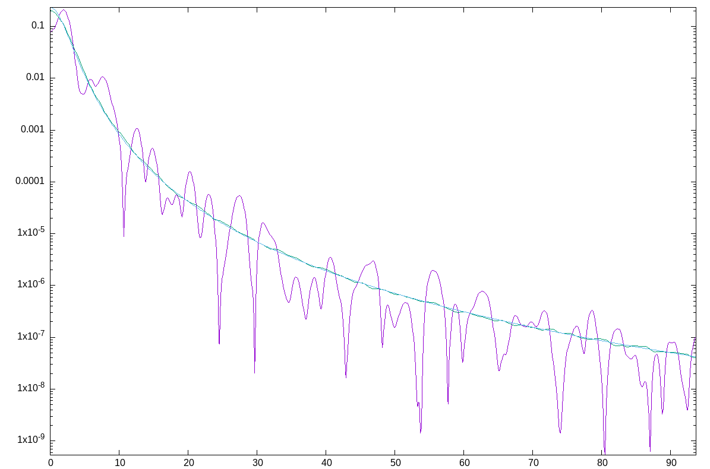

# IrregularSpectra.jl

This repository is the software library companion to [Nonparametric spectral
density estimation from irregularly sampled data](https://arxiv.org/abs/2503.00492). 
If this package was useful to you or provided functionality that was important to your
work, please cite it as the following paper:
```
@article{gb2025_irregular_sdf,
  title={Nonparametric spectral density estimation from irregularly sampled data},
  author={Geoga, Christopher J. and Beckman, Paul G.},
  journal={arXiv preprint arXiv:2503.00492},
  year={2025}
}
```

# Basic usage demonstration

Here is a heavily commented demonstration, which can also be found as a plain
code file in `./examples/simple_demo.jl`.

First, let's generate some data. This picks `n=3000` uniform locations on `[a,
b] = [0, 1]` and simulates a Matern process with the chosen parameters at those
values. This package offers the Matern kernel and spectral density both for
convenience and for use in some upcoming heuristic tools for selecting the
maximum resolved frequency Ω, which is a central concept in the paper and
directly controls the tradeoff between how far into the tails of the SDF you can
estimate and the size of the bias.
```julia
using IrregularSpectra

# Generate n uniform points on [a, b]:
n      = 3000
(a, b) = (-1.0, 1.0)
pts    = sort(rand(n).*(b-a) .+ a)

# Simulate a Matern process at those points with m replicates:
m   = 500 # number of replicates
sim = let kernel = (x,y)->IrregularSpectra.matern_cov(x-y, (1.0, 0.1, 1.75))
  IrregularSpectra.simulate_process(pts, kernel, m)
end
```
From here, the estimator is easy to obtain: select the window function we wish
to use (and it is easy to bring your own!), and use the `estimate_sdf` function.
In this example we use a Kaiser window with half-bandwidth `6.0`, which is a
good default choice for samples that don't have big gaps (see below for
gap-friendly alternatives). The function `estimate_sdf`, if given multiple iid
samples as columns in `sims`, will average the multiple estimates.

```julia
window    = Kaiser(6.0, a=a, b=b)
estimator = estimate_sdf(pts, sims, window)
```
The return object `estimator` is a `IrregularSpectra.SpectralDensityEstimator`.
Similar to return types in `DSP.jl` and others, you can summarize it with things
like 
```julia
plot(estimator.freq, estimator.sdf, [... your other kwargs ...])
```
The other internal components in that struct are subject to change, but
hopefully at least these two fields of `freq` and `sdf` will now be stable.

The script document in `./examples/simple_demo.jl` just uses printing as a
diagnostic, but here is a visual one where we estimate at more frequencies (this
plot was made with my own wrapper of Gnuplot that uses sixel output, but
substitute with your preferred plotting tool):
```julia
truth = IrregularSpectra.matern_sdf.(many_est_freqs, Ref((1.0, 0.1, 1.75)))
est1  = estimate_sdf(pts, sims[:,1], window)
gplot(est1.freq, est1.sdf, estimator.sdf, truth, ylog=true)
```

<p align="center">
    
</p>

This plot shows the estimator from a single sample (purple), the average
estimate from `m=500` replicates is shown in blue (indicating that the bias in
the estimate is minimal compared to its expected value), and the true SDF is
shown in green.

# Irregular data with large gaps

If you have irregular data with gaps, you are much better off using a
(generalized) prolate function, which can be yield estimator weights whose norm
is dramatically smaller than a standard Kaiser window and thus yield estimators
with significantly lower bias. The above example can be very gently modified for
this case as follows:

```julia
using IrregularSpectra

# Your irregularly sampled points, supported on the listed intervals.
intervals = [(a_1, b_1), ..., (a_k, b_k)]
pts       = [...] # your measurement locations
data      = [...] # your measurement values 

window = Prolate1D(bandwidth, intervals)
estimator = estimate_sdf(pts, data, window)
```

You should be mindful in selecting the highest frequency to estimate, as the
continuous Nyquist frequency will be capped as the smallest value for each
segment. See `./examples/gaps_prolate.jl` for a full example.

**NOTE:** This prolate function method is useful for handling gaps, but there
are sampling circumstances where it simply does not make sense to compute one
joint estimator. If you have 1M points on `(0, 0.1)`, for example, you can
resolve exceptionally high frequencies...but your window function will need to
have a bandwidth on the order of hundreds or thousands to be well concentrated.
And if you have `1000` points on `(10, 100)`, your can make a window with a
fabulously small bandwidth but it will not be able to resolve high frequencies.
In a setting like that, we suggest computing and analyzing two separate
estimators for each measured interval.

**NOTE:** a less sophisticated 2D prolate window is also available. See the
example files for a demonstration.

# Experimental features/interfaces

## `Krylov.jl`-powered implicit methods for weight computation

Computing the weights required for this estimator takes O(n^3) work if done
naively. But using the accelerations of the NUFFT and implicit Krylov methods
with a carefully chosen preconditioner, we now offer as the default option an
implicit method that in ideal cases scales quasilinearly instead. The secret
sauce here is that the NUFFT accelerates the nonuniform Fourier matrix
applications, but the linear system being solved is basically singular, and so
you also need a clever preconditioner. 

As of now, the default preconditioner uses a dense Cholesky factorization. This
is `O(n^3)` operations, naturally, but for small data sizes (maybe n ~ 5-10k or
less) it is still faster than the scalable one. For larger data sizes, there is
an extension of this package using 
[`HMatrices.jl`](https://github.com/IntegralEquations/HMatrices.jl) 
that offers a truly `O(n \log n)` preconditioner, and so you can still estimate
SDFs from hundreds of thousands of points in seconds. See
`./example/big_demo.jl` for an example.

# Roadmap

This software library is under very active development. An incomplete list of
features to expect in the near future:

- A heuristic tool for handling potentially gappy one-dimensional domains that
  adaptively splits the data domain into disjoint segments based on large gaps
  and balancing the tradeoff between reducing the norm of the weights and the
  off-lobe power in the spectral window. This is again something we have
  implemented and all that is left to do is to polish it.
- An interface for providing arbitrary points in arbitrary dimensions and
  obtaining prolate function evaluations and right-hand sides for weight
  calculation. This is done _except_ for the step of a designing a robust function
  for automatically obtaining a quadrature rule on the point domain given just
  points. But good tools exist for triangulation-based methods, and so we just
  need to hook into them. Contributions in this space would certainly be welcome.
- A tool for classifying different categories of sampling schemes. Samples on a
  regular grid can be handled much faster, and same for a gappy regular grid
  (although with different mechanisms for each). It would be very nice for this
  tool to be sufficiently general that it takes _any_ points and gives you back
  a decent estimator that has been computed as rapidly as possible.

